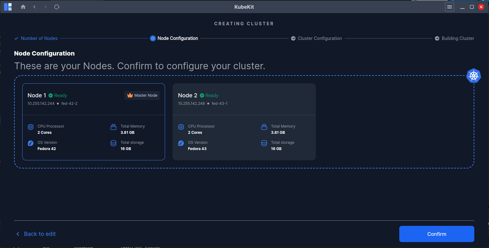

# Node Configuration

On the first page of **Node Configuration**, you can set the number of nodes for your cluster, ranging from **2 to 15**, and designate one node as the **master**. You can modify all node-related details here, including the **host IP**, **SSH username**, and **SSH authentication method**.

After clicking **Continue**, KubeKit will verify the connectivity of all nodes.  

If all checks pass, a confirmation page will appear. Click **Confirm** to begin the cluster creation proces

