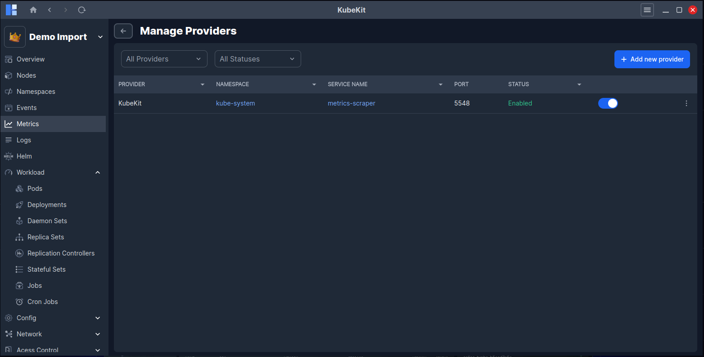
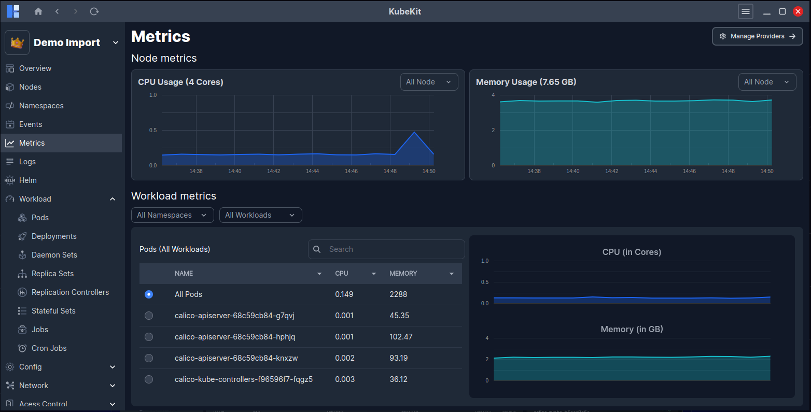

# Metrics

Metrics provide quantifiable insights into your cluster’s performance, resource utilization and operational health. By measuring key indicators such as CPU, memory, network I/O and object-state changes you gain the ability to proactively manage workloads, detect anomalies, optimize capacity, and support autoscaling. In the context of a Kubernetes cluster, metrics are fundamental to maintaining stability, enabling cost-efficiency and ensuring your applications scale appropriately.

---

## Managing metrics provider  
When creating a cluster with **KubeKit**, you have the option to choose one of two metrics providers: **Prometheus** or the built-in KubeKit metrics engine. If you skip this during creation, you still retain the flexibility to configure your preferred toolkit later.

---

## Access a Cluster Dashboard  
From the KubeKit home screen, you will see all clusters you have created or imported. Select the desired cluster to open its **Cluster Dashboard** this is your starting point for accessing metrics.

---

## Click on Metrics on the left bar
Within the cluster dashboard, locate the **Metrics** menu in the left sidebar. Click it to navigate to the metrics page. If you have not yet configured a monitoring toolkit, you may do so here.

---

## View Node Metrics  
On the metrics page, one of the categories is **Node Metrics**. This view shows CPU usage, memory usage and other vital statistics for all nodes in the cluster. You may also filter to view metrics for a selected node if desired.

---

## Explore Workload Metrics  
The second category is **Workload Metrics**. This allows you to visualise performance and resource data for all pods or, when needed, a subset of selected pods. Use this to assess how workload behaviour evolves under different conditions.

