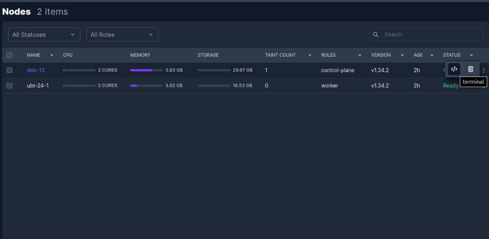

# **Nodes**

This section provides a comprehensive overview of all nodes that are part of your cluster. It allows you to quickly inspect node details, verify their health, and perform administrative actions. You can search for specific nodes by name and apply filters based on **status** or **roles** to narrow down the list and focus on the nodes that matter.

## Access Node Terminal

From the KubeKit **Cluster Dashboard**, open the **Nodes** section using the right-sidebar navigation. On the **Nodes** page, you will find a table displaying every node in your cluster along with key metadata such as name, role, and status.

Identify the node you want to access, then click the three-dot action menu on the far right of its row. Select **Terminal**. A shell session will open instantly, allowing you to run commands directly on the selected node without leaving the KubeKit interface.

