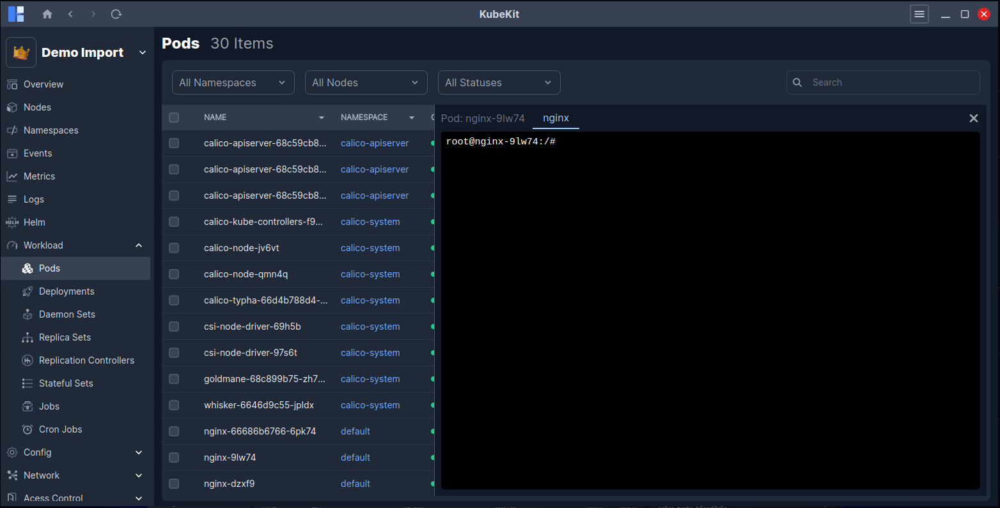

## Access Node Terminal

From the KubeKit **Cluster Dashboard**, open the **Nodes** section using the right-sidebar navigation. On the **Nodes** page, you will find a table displaying every node in your cluster along with key metadata such as name, role, and status.

Identify the node you want to access, then click the three-dot action menu on the far right of its row. Select **Terminal**. A shell session will open instantly, allowing you to run commands directly on the selected node without leaving the KubeKit interface.

### Access pod terminal
You can also access the terminal of a pod directly from the dashboard. To do this, navigate to the Workloads section and select Pods. On the Pods page, locate the pod you want to access and click the three-dot action menu on the far right of its row. From the menu, click the Terminal button to open a shell session into the container running inside that pod. This feature enables you to interact with the pod directly for troubleshooting, configuration, or monitoring purposes.

