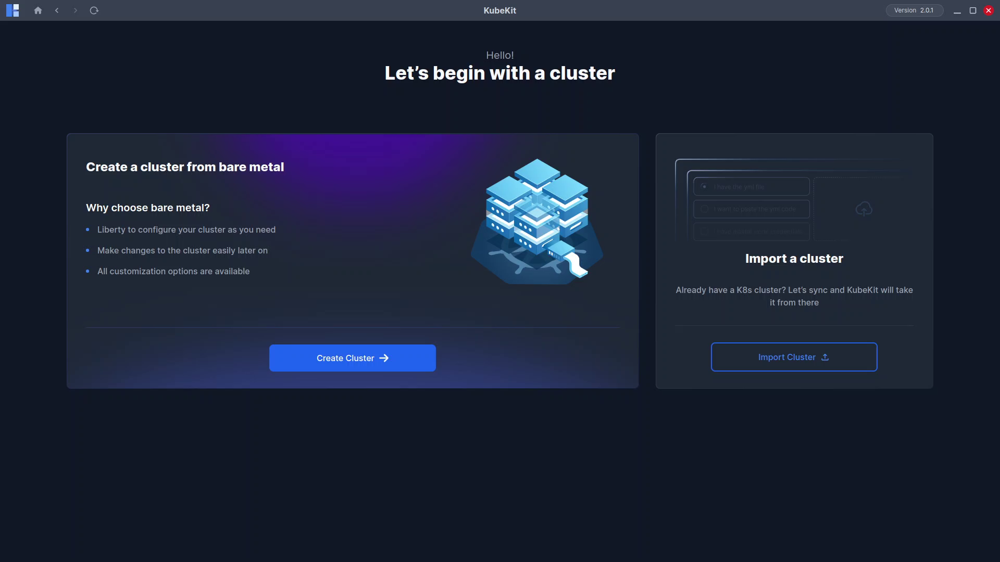
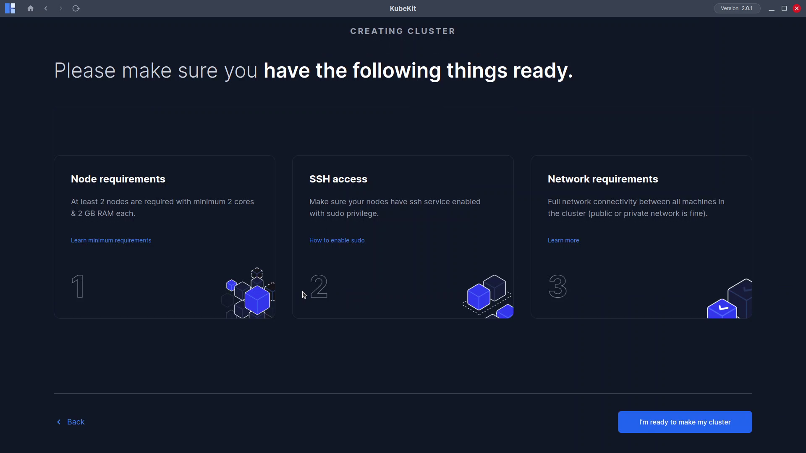
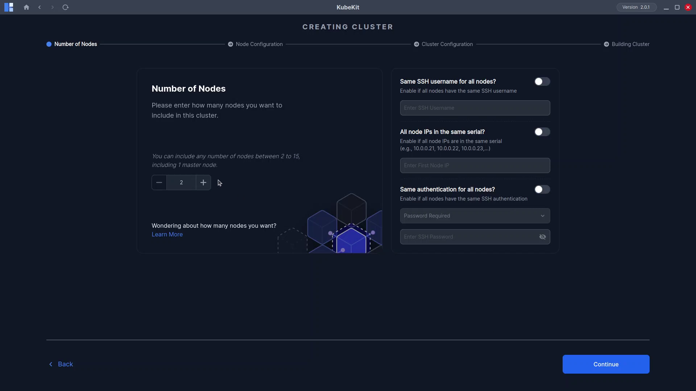
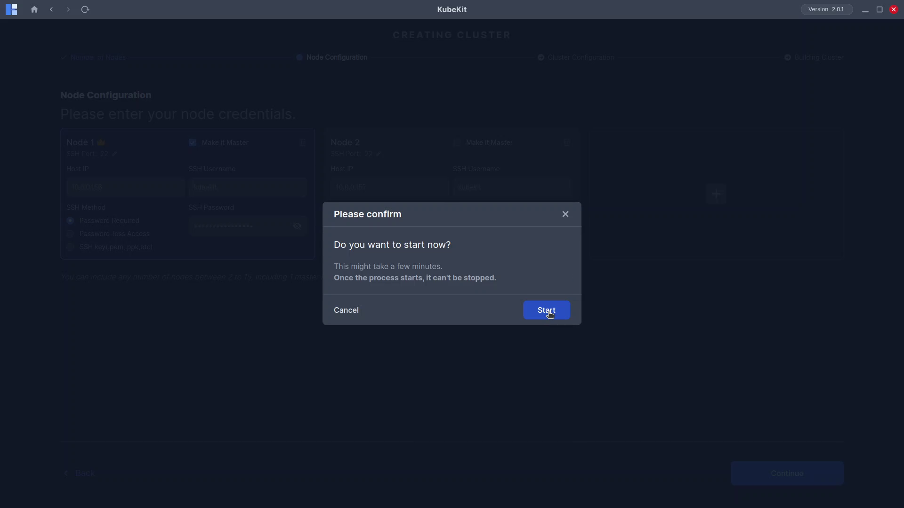
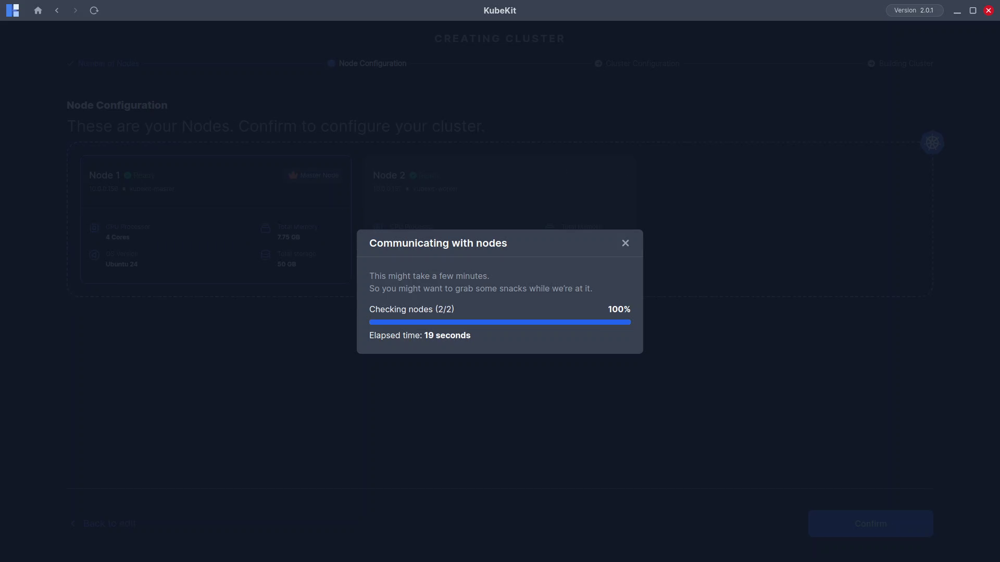
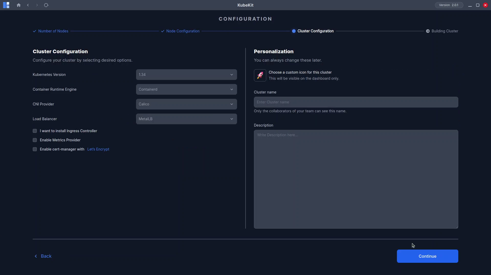
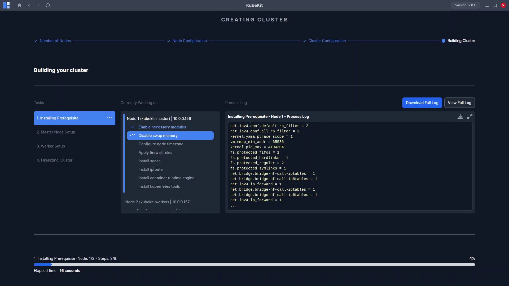
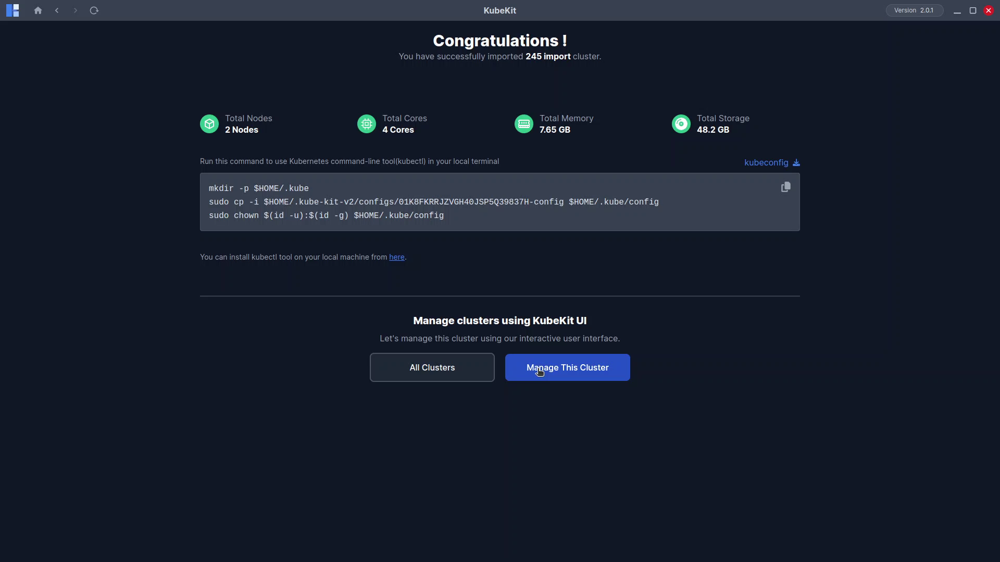

# Creating Your First Cluster

Creating a cluster in **KubeKit** is simple, fast, and effortless. Follow these steps to set up your first Kubernetes cluster. You can include images for each step to visually guide users.

---

### **Step 1: Open the Home Page**

On the KubeKit home page, click **Create Cluster**.
An information page will appear. After reviewing it, click **I am ready to make my cluster** to proceed.



<!-- TODO: Add image -->

---

### **Step 2: Configure Node Details**

In this page, you have to provide information related to your nodes.




On the **left side of the screen**, you will see the **Node Count** section:

* Adjust the total number of nodes for your cluster.
* A **minimum of 2 nodes** is required.
* Use the **+** and **−** icons to increase or decrease the number of nodes.

On the **right side of the screen**, you will find several **options** that make configuration easier. These are designed to help when your cluster contains many nodes with similar settings.

For example, when creating a cluster with a large number of nodes, you may have node IPs in a similar range such as:

```
10.0.0.21, 10.0.0.22, 10.0.0.23
```

If all nodes share the same **username** and **password** or have a similar **access method**, you can use these options to **prefill** the information automatically. This saves time and ensures consistency.

If your nodes do not follow a similar pattern, don’t worry as you can manually adjust or update each node’s information on the next page.

When ready, click **Continue** to move forward.

---

### **Step 3: Provide Node Information**

This page is for providing information for individual nodes. If you have chosen to fill similar IPs, nodes, or usernames in the previous page, then you will find that all the information has been prefilled for you. If you have not used those options, you will need to fill out each node’s information manually.

On the **Node Information** page:

* For each node, enter the **IP address** and **access method** (e.g., SSH credentials).
* You will see one form per node based on your previous selection.
* Designate one node as the **Master Node**. You can choose any node to be the master.
* Use the **Delete** button to remove a node or **+ Add Node** to include more.

Click **Continue** when all nodes are configured.


A confirmation pop-up will appear asking to start verification. Click **Start** to begin.




---

### **Step 4: Node Verification and Preview**

KubeKit will now check the accessibility of your virtual machines (VMs):

* If any node is unreachable, an **error message** will appear.
* Once all nodes are verified, a **Preview Page** will display the following details:

  * CPU count
  * Total memory
  * Operating system
  * Total storage

Click **Continue** to move forward.


---

### **Step 5: Configure Cluster Settings**

On the **Cluster Configuration** page:

* Choose the components you want to install. You may continue with default options or customize as needed.
* Provide a **Cluster Name** and an optional **Description**.

Click **Continue** to proceed.




---

### **Step 6: Start Cluster Creation**

A confirmation dialog will appear. Click **Start** to begin the cluster creation process.


* Depending on your **internet speed**, **VM resources**, and **node count**, the setup may take some time.
* You can monitor progress and view logs during installation.



If an error occurs (often due to network issues):

* The process will stop.
* A **Retry** button will appear.
* Click **Retry** to continue from where it stopped.
<!-- TODO: Add image of cluster creation error -->

---

### **Step 7: Completion and Dashboard Access**

When the process completes successfully, a **Congratulations** page will appear.

Click **Manage This Cluster** to open your **Cluster Dashboard**, where you can start managing your cluster.

You have now successfully created your first Kubernetes cluster using KubeKit!


