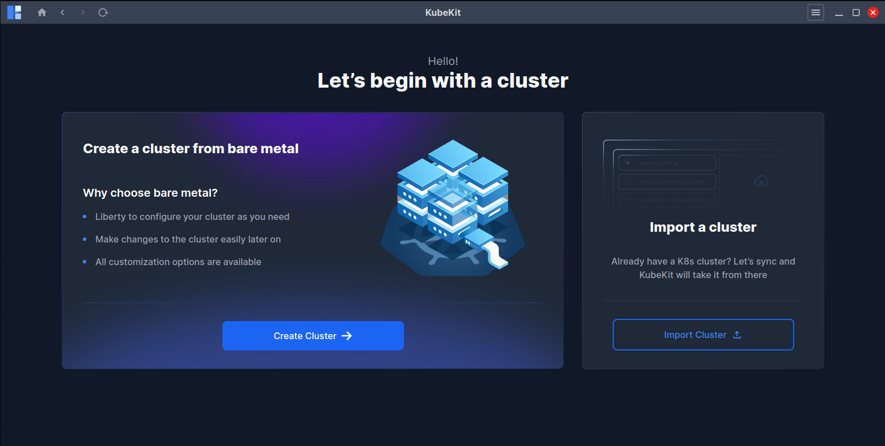
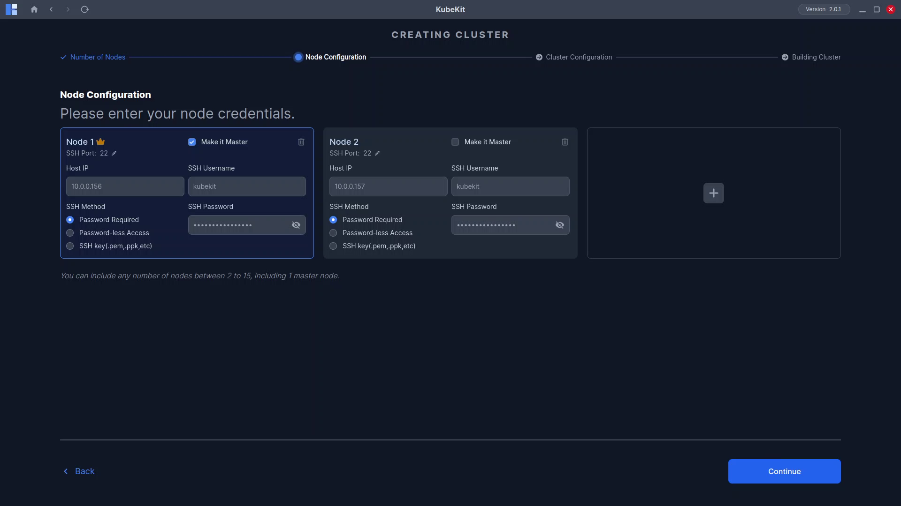
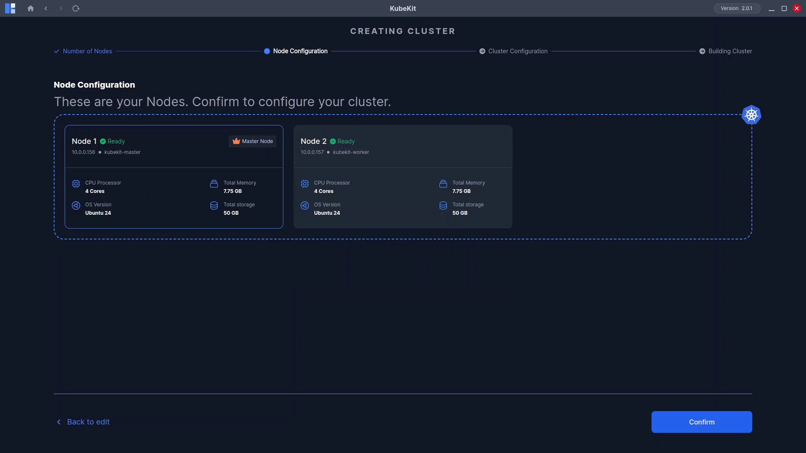
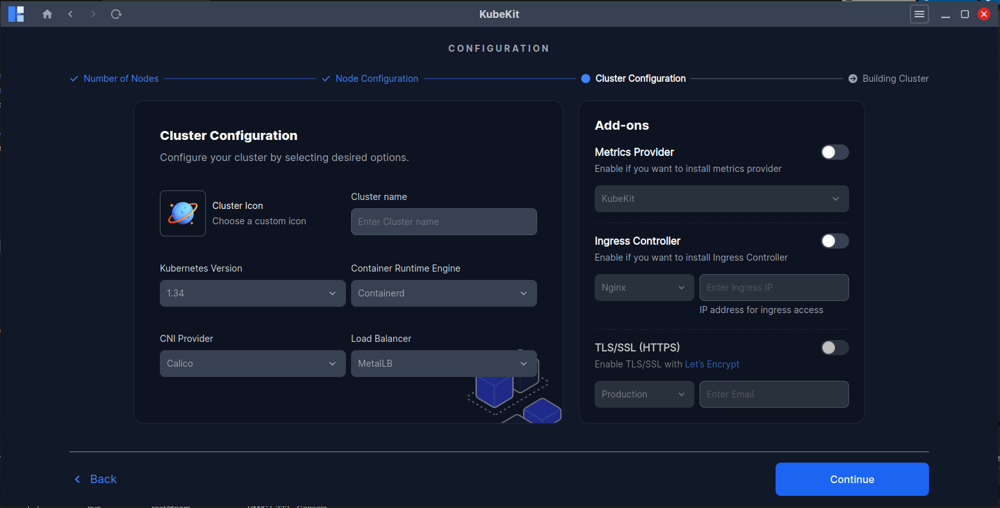
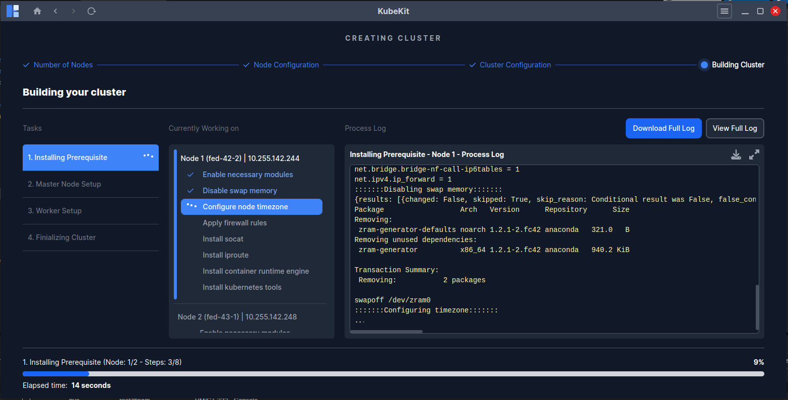
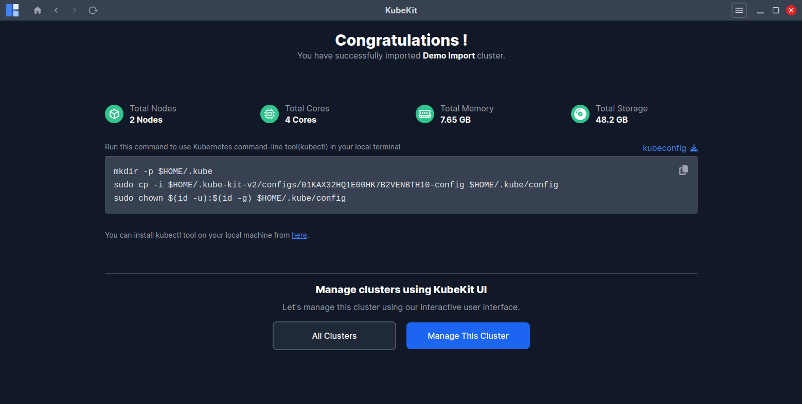

# Creating Your First Cluster

Creating a cluster in **KubeKit** is simple, fast, and effortless. Follow these steps to set up your first Kubernetes cluster. You can include images for each step to visually guide users. See the prerequisites for creating a KubeKit cluster [here](/docs/cluster/creation/prerequisites.md).

---

### **Step 1: Open KubeKit Application**

At first, Click on the **Get Started** button, this will bring the below page.

If you have any existing cluster cluster, you can proceed with [importing](/docs/cluster/importing-a-cluster.md).
Now click **Create Cluster** button to start cluster creation, then follow the requirement guideline. 

---

### **Step 2: Configure Node Information**

Here, you provide total numbers of nodes.

You will find several optional options that will make configuration easier. (If you  have many nodes with similar configuration.)

- If all your nodes have the same username, then you enable the first switch and enter the username. 
- If all your node IPs are in the same serial. Like, you have three nodes and your IPs look like below:
  * First node has the IP of `10.0.0.21` 
  * Second node has the IP of `10.0.0.22` 
  * Third node has the IP of `10.0.0.23` 
  Then enter the first node's IP only, which is `10.0.0.21`.
- If all your nodes have the same ssh methods, then enable the switch and select common method for all nodes and enter the ssh password or upload the ssh-key file respectively. 

Finally, click **Continue** to move forward.

---

### **Step 3: Verify/Edit Node Information**

Here you can see details information of your each node separately, also you can modify or adjust node information independently.

* Select your master node first, You can select any node as master node.
* You can edit the ssh port(if it's not 22).
* Use **+** or **Delete** button to add or remove any node.

Click **continue** and it will ask you for confirmation for node access and **requirements** check.

---

### **Step 4: Node Information Preview**

* After successfully checking all of your nodes, the below node details will be previewed:

  * CPU count
  * Total memory
  * Operating system
  * Total storage

* If any node is unreachable, an **error message** will appear.

Click **Continue** to move forward.
<!-- todo:image will be updated -->

---

### **Step 5: Configure Cluster**

On the **Cluster Configuration** page:
 * Select your cluster icon and provide a name for your cluster, this will appear in the dashboard after creation.
 * Choose your desired Kubernetes version, Container Runtime Engine, CNI Provider, Load Balancer. Or you can keep the default options.
 * KubeKit support multiple Add-ons options, which are optional
    * **Metrics Provider**: You can enable Metrics Provider like kubekit or Prometheus. (Kubekit is a light-weight metrics which work with metrics server)
    * **Ingress Controller**: You can choose your desired ingress controller and provide ingress IP to access your ingress service.
    * **TLS/SSL(HTTPS)**: If you want to enable TLS/SSL(HTTPS) in your cluster, then enable the switch, provide your email. If you want to know more, click [here](/docs/cluster/creation/Cluster-configurations.md) 

Click **Continue** to start the cluster creation process.

---

Great!! Your cluster is building now

Depending on your **internet speed**, **VM resources**, and **node count**, the setup may take some time.

If an error occurs (often due to network issues):

* The process will stop.
* A **Retry** button will appear.
* Click **Retry** to continue from where it stopped.
* You can also track the error logs.

---

**Congratulations!!** You have now successfully created your first Kubernetes cluster using KubeKit!

Click **Manage This Cluster** to open your **Cluster Dashboard**, where you can start managing this cluster.

